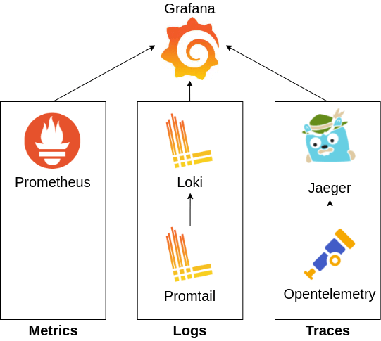
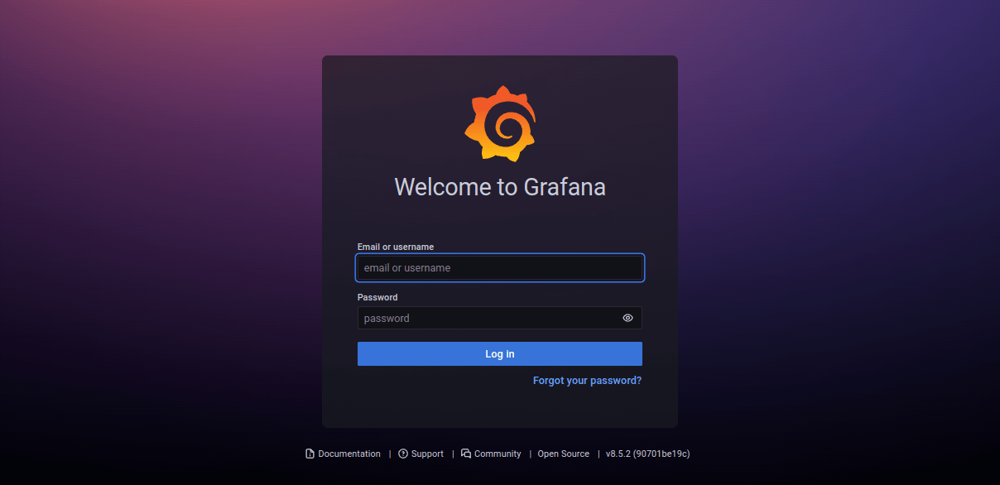
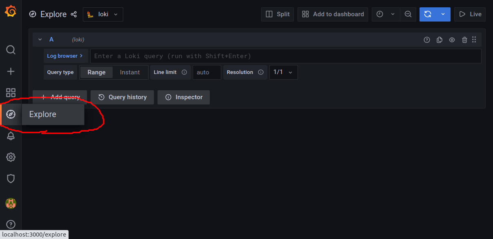
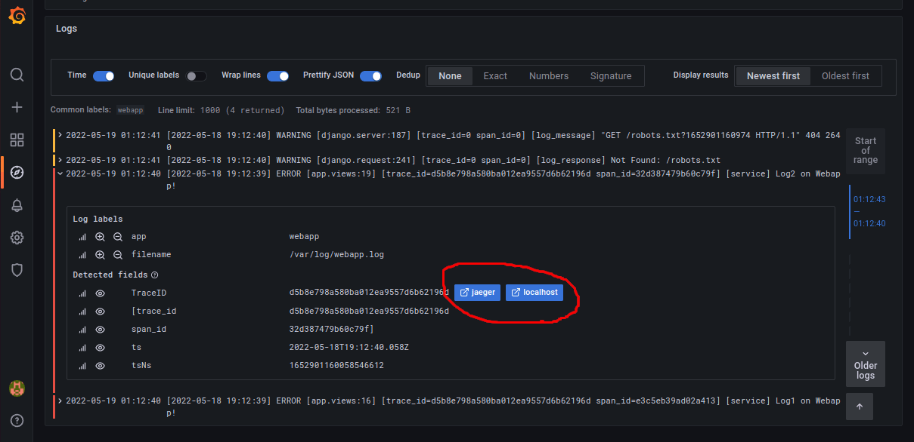
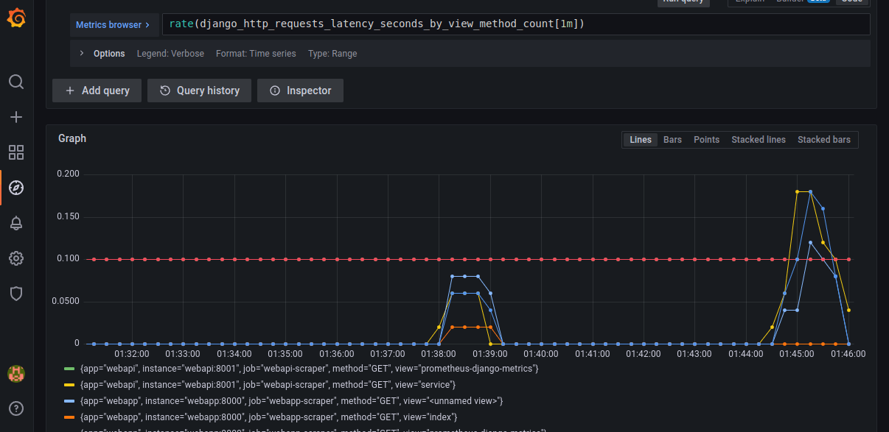
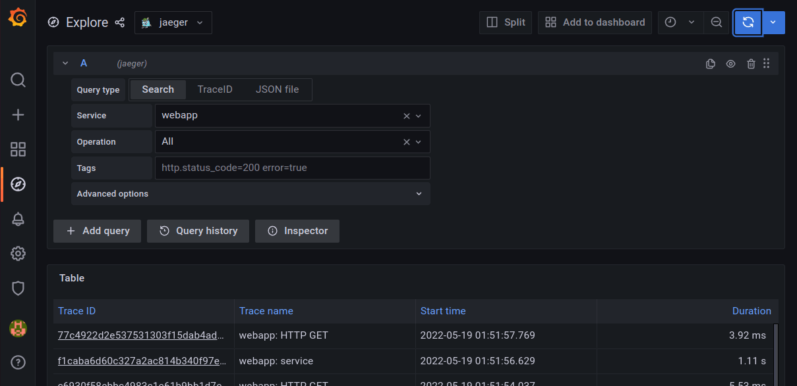
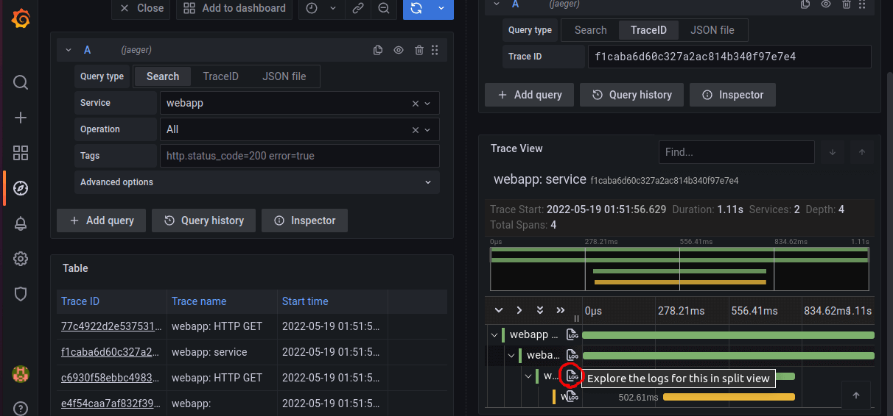

# opentelemetry-python-grafana-mlt

This project is a demonstration of how observability can be implemented in microservices/distributed systems that are built with python/django. For monitoring, the MLT observability triad is collected:
* Metrics
* Logs
* Traces

To see the complete article/tutorial, go to [rafed.github.io/devra/posts/cloud/django-mlt-observability-with-opentelemetry/](https://rafed.github.io/devra/posts/cloud/django-mlt-observability-with-opentelemetry/).

Open source technologies listed below are used to collect MLT data:

1. **Grafana** _[Dashboard]_: This is a dashboard where we will observe the MLT data collected by the rest of the services.
2. **Prometheus** _[Monitoring]_: Collects and stores metrics from applications.
3. **Promtail** _[Logging]_: Collects log data from applications and sends them to Loki.
4. **Loki** _[Logging]_: Aggregates and stores all logs sent by Promtail.
5. **Opentelemetry** _[Tracing]_: Instruments an app to collect traces and sends them to Jaeger.
6. **Jaeger** _[Tracing]_: Collects and stores tracing information. Also helps in trace visualization.

The following figure summarizes the technology dependencies.



To run the project, follow the steps below.

```bash
$ git clone https://github.com/rafed/opentelemetry-python-grafana-mlt

$ cd opentelemetry-python-grafana-mlt

$ docker-compose up
```

Make some requests on the webapp [localhost:8000/service](http://localhost:8000/service) to generate MLT data. Then, go to [localhost:3000](http://localhost:3000]) to view the grafana dashboard. Login using username:admin and password:admin.



Go to **explore** and you should be able to see MLT data collected from the apps. Check demo below.

#### Grafana dashboard


#### Logs from Loki


#### Metrics from Prometheus


#### Traces from Jaeger



To see the complete article/tutorial, go to [rafed.github.io/devra/posts/cloud/django-mlt-observability-with-opentelemetry/](https://rafed.github.io/devra/posts/cloud/django-mlt-observability-with-opentelemetry/).